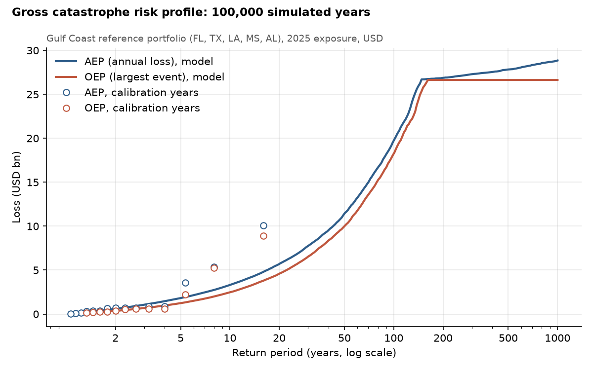
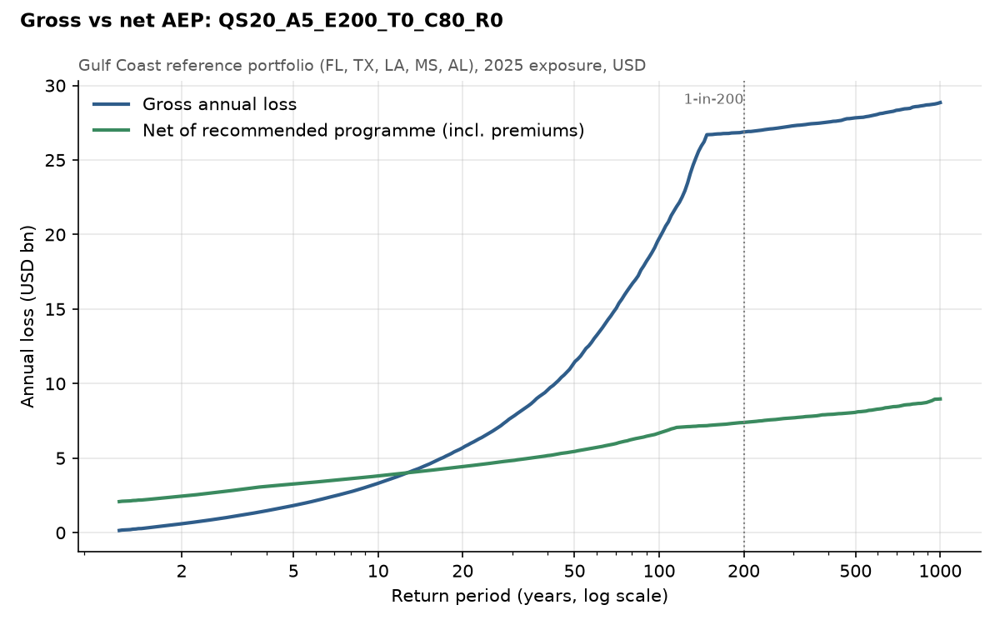
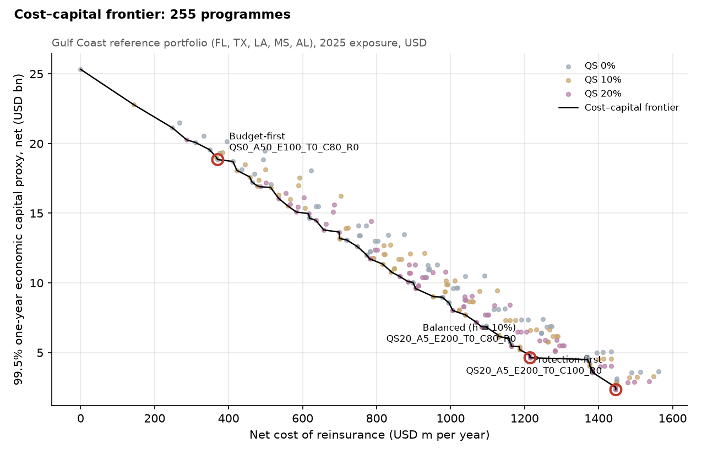

# Flood Catastrophe Reinsurance & Capital Optimisation

> For a flood insurer exposed to catastrophe accumulation, what reinsurance programme should it buy, how much should it pay, and how much tail risk and economic capital does that programme remove?

A reinsurance decision study for a stylised Gulf Coast flood portfolio (FL, TX, LA, MS, AL) built from public NFIP data. Historical flood events from 2009–2023 are restated to 2025 exposure (USD 805bn insured value, 2,892,970 insured units) and turned into a stochastic annual loss model of 100,000 simulated years. 255 quota-share and catastrophe excess-of-loss programmes are priced on a technical basis and compared on net cost against the 99.5% one-year economic capital proxy they release.

**Answer.** Buy 20% quota share + 1-in-5 to 1-in-200 Cat XoL, 80% placed, no reinstatement (`QS20_A5_E200_T0_C80_R0`). It reduces the 99.5% one-year economic capital proxy by **81.7%** (USD 20,694m) for a net cost of **USD 1,215m a year**, an implied cost of capital of **5.9%**, below the 10% hurdle. The case rests on the reinsurer's diversification: with none (d = 1) the implied cost of capital rises to 11.5% and the same rule picks no reinsurance.

## 1. Gross catastrophe risk profile



20 catastrophe events above USD 100m (as-if) in 2009–2023, the largest Hurricane Harvey (USD 8,880m on 2025 exposure). Frequency Poisson (1.33 events a year); severity left-truncated log-logistic, capped at 3× the largest event. Gross 1-in-200 annual loss USD 26,874m; 99.5% economic capital proxy USD 25,325m. The 1-in-200 event sits at the event cap, so the far tail is an assumption, and is tested below.

## 2. Recommended programme



| Treaty | Attach (USD m) | Exhaust (USD m) | Return periods | AP | Share | Reinst. | Premium (USD m) | ROL | Multiple |
|----------------|----------|----------|------------------|-------|-------|-------|----------|-------|--------|
| Quota share 20% | – | – | all losses | – | 20% | – | 597 | – | – |
| Cat XoL 1 | 990 | 21,310 | 1-in-5 to 1-in-200 | 20.0% | 80% | 0 | 1,369 | 8.4% | 3.1× |

Prices are indicative technical premiums: modelled expected loss plus a charge of 10% on 0.5 × the reinsurer's TVaR capital, grossed up for expenses, net of expected reinstatement premium.

## 3. Cost–capital frontier



79 of 255 programmes are efficient. Budget-first: 1-in-50 to 1-in-100 Cat XoL, 80% placed, no reinstatement (26% relief for USD 370m). Balanced at a 10% hurdle: the recommendation above. Protection-first: 20% quota share + 1-in-5 to 1-in-200 Cat XoL, 100% placed, no reinstatement (91% relief for USD 1,447m).

## 4. Validation and market benchmark

The exact contract held in 4 of 9 stress scenarios and its layer structure in 9 of 9; the others change only the placement share. The tail is fragile: without Hurricane Harvey gross economic capital falls by 57%, and a year bootstrap gives a 90% interval of 53%–82% for capital relief and 5.9%–11.0% for the implied cost of capital. At attachment probabilities of 4%–9%, technical rates on line (7.2%–9.0%) are below FEMA's 2025 NFIP placement (18.5%), mainly because the model's layers are wider; price multiples of expected loss (2.8–4.6×) are comparable with FloodSmart Re cat bonds (2.7–3.0×). Benchmarks are order-of-magnitude checks only, never calibration targets.

Full write-up: [`reports/memo.pdf`](reports/memo.pdf). Data checks, event catalogue, model selection and decisions: [`reports/`](reports/). Treaty mechanics are checked independently in [`excel/reinsurance_checks.xlsx`](excel/reinsurance_checks.xlsx).

## Reproduce

```bash
uv sync
make all     # first run downloads and freezes the OpenFEMA data through the API (about an hour), then rebuilds every output
make test
```

Every number above is written by the pipeline to `outputs/` (see `outputs/cv_numbers.json`, git `93c173f`).

## Data and disclaimer

Data: OpenFEMA NFIP Redacted Claims and NFIP Redacted Policies. This product uses the FEMA OpenFEMA API, but is not endorsed by FEMA. The Federal Government or FEMA cannot vouch for the data or analyses derived from these data after the data have been retrieved from the Agency's website(s). The Gulf Coast portfolio is a stylised insurance portfolio calibrated to the exposure and claims experience observed in the NFIP Gulf states; it is not intended to reproduce the finances of the NFIP itself. Reinsurance prices are indicative technical premiums, not market quotes. Economic capital is a 99.5% one-year proxy, not a Solvency II SCR.
